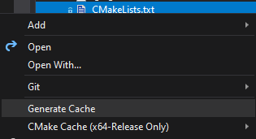

# Game - The Charlatan's Arena

The Charlatan's Arena is a 2D game where the player is a gladiator tasked with taking down the champion of the coliseum.

## How to Run

### Requirements

Given that the Game uses the GameAgent library, it requires PyTorch C++.

Download for PyTorch C++ can be found here: https://pytorch.org/get-started/locally/

***NOTE: The current implementation for the library only supports the CPU computing platform.***

Once downloaded just add an absolute path to libtorch in the CMake command arguments.

```
-DCMAKE_PREFIX_PATH="C:\\PathToLibTorch\\libtorch"
```

***NOTE: Given the current implementation it would be easier to add this into the CMakeSettings.json file using VS.***

### VS2019 (CMake)

***NOTE: CMake currently not formatted to build properly with the command line or CMake Gui. Therefore instructions will be explaining how to install through VS2019.***

#### Step 1:

Open Game folder with Visual Studio 2019.

#### Step 2:

Right click CMakeList.txt under Game/ and select Generate Cache.

<p>
    
</p>

#### Step 3:

Build Project by pressing Ctrl + Shift + B.

This will build the project and provide a executable.

#### Step 4:

Select Game.exe from the Select Startup Item dropdown and run it.

## Controls

```
W       - Navigate/Move Up
S       - Navigate/Move Down
A       - Navigate/Move Left
D       - Navigate/Move Right
Enter   - Confirm
K       - Use Weapon 1
L       - Use Weapon 2
Esc     - Pause/Back
```
